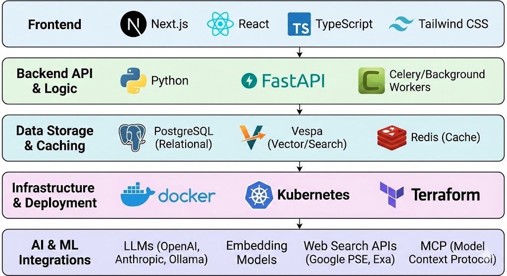
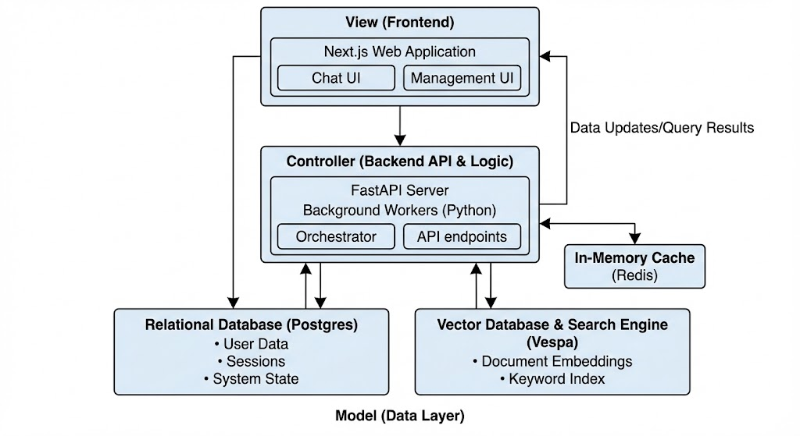
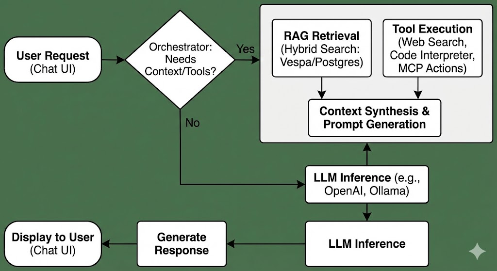

# Onyx: Open Source AI Platform
https://github.com/danswer-ai/danswer

Onyx is an LLM-agnostic, self-hostable Chat UI and agentic platform designed for secure enterprise-grade RAG and AI workflows.

### ✅ Advantages

* **Privacy & Control:** Fully air-gappable and self-hostable.
* **Deep RAG:** Hybrid search + knowledge graph; scales to 10M+ documents.
* **Agentic Power:** Built-in Web Search, Code Interpreter, and MCP support.
* **Connectivity:** 40+ data connectors (Slack, SharePoint, etc.) with mirrored permissions.
* **Enterprise Ready:** Supports SSO (OIDC/SAML), RBAC, and encryption.

### ❌ Disadvantages

* **Stability Risks:** Recent regressions in Slack/GPU support (v2.10+).
* **Performance:** CPU embedding can be slow; indexing occasionally stalls.
* **Maturing Security:** Requires manual security policy setup; recent critical patches for token handling.
* **Feature Gaps:** Missing file uploads for Code Interpreter and exact-match search.

---

### 🛠 Tech Stack

* **Deployment:** Docker, Kubernetes, Terraform.
* **AI Models:** OpenAI, Anthropic, Gemini, Ollama, vLLM.
* **Search/Tools:** Google PSE, Exa, Serper, Firecrawl.
* **Auth:** OAuth2, SAML, OIDC.

---

### 🔄 Architecture & Control 

**High-Level Request Flow:**
`User Request` → `Chat UI` → `Onyx Backend` → `Orchestrator` → `LLM` → `Response`

**Agentic/RAG Loop:**

1. **Analyze:** Determine if the query needs external data or tools.
2. **Retrieve/Act:** Fetch data from **Connectors** (RAG) or trigger **Tools** (Web Search/Code).
3. **Synthesize:** Feed context + tool outputs into the LLM.
4. **Output:** Return the grounded response to the UI.

> *Note: Architecture visualization illustrating the link between connectors, the orchestrator, and the LLM.*

---

**Next Step:** Would you like me to draft a specific Docker Compose file to help you get started with a local deployment?