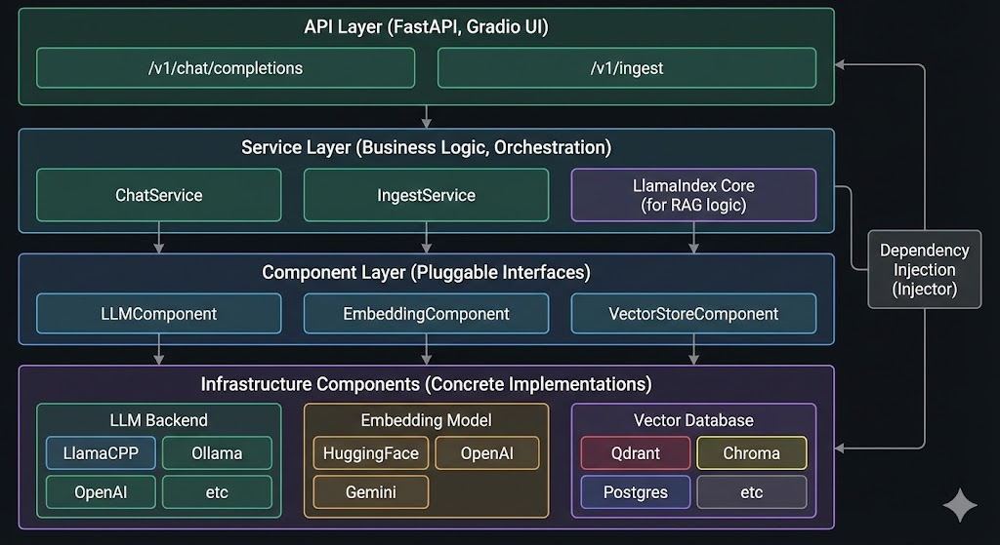
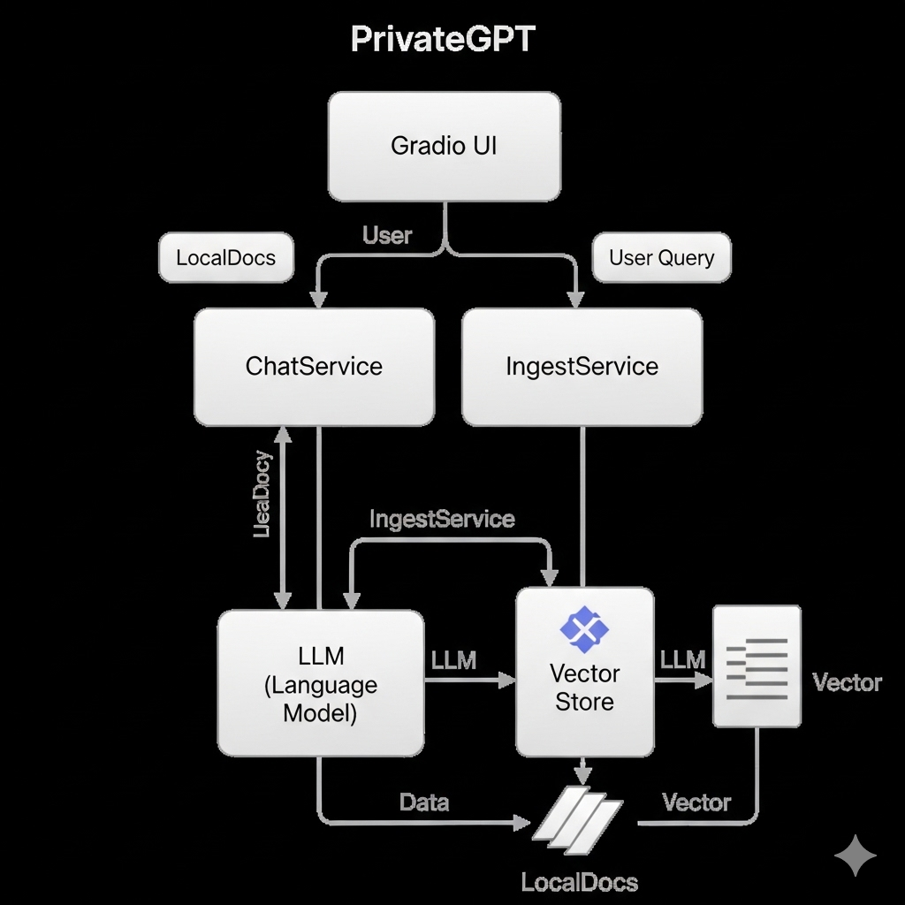
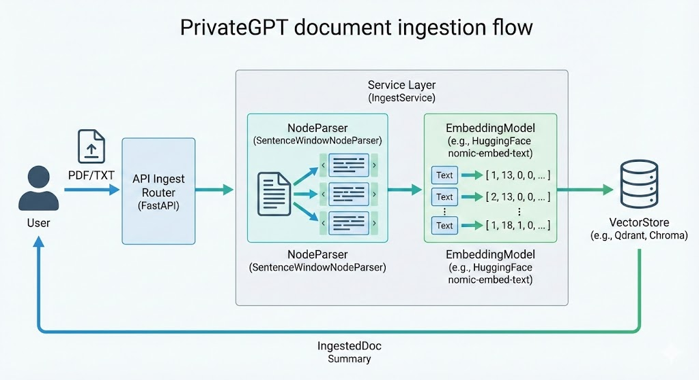
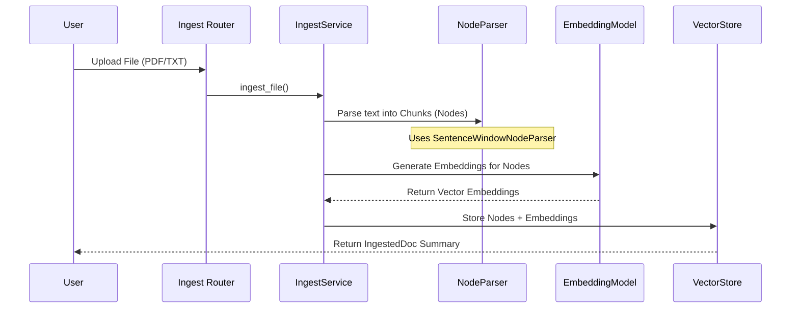
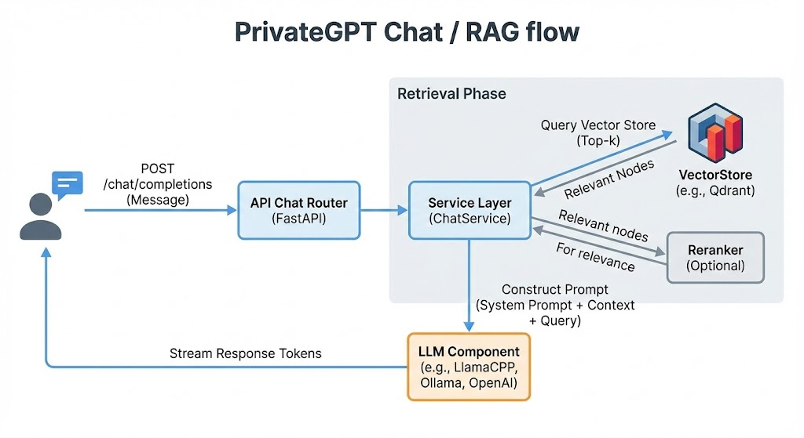
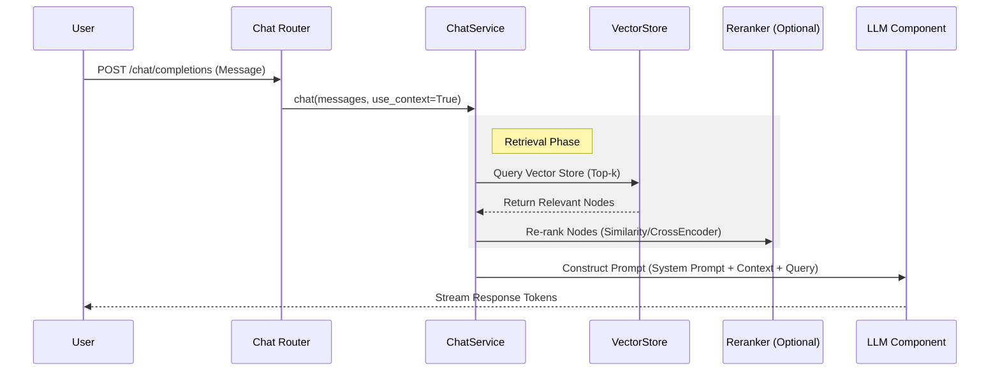

# PrivateGPT Project Documentation

## 1. Project Overview
PrivateGPT is a production-ready AI project designed to enable **Retrieval Augmented Generation (RAG)** using Large Language Models (LLMs). Its primary value proposition is **privacy**: it allows users to ask questions about their own documents without the data ever leaving the local execution environment. It is built to be offline-capable and API-compatible with OpenAI standards.

## 2. Commercial Use & Licensing
* **License:** Apache License 2.0
* **Commercial Viability:** **YES.**
    * The Apache 2.0 license is a permissive free software license.
    * **Rights:** You are free to use, reproduce, modify, distribute, and sell this software (or derivatives of it) for commercial purposes.
    * **Conditions:** You must include a copy of the license, preserve copyright notices, and state significant changes made to the code.
    * **Liability:** The software is provided "AS IS" without warranty. The contributors are not liable for damages.

## 3. Advantages & Disadvantages

### Advantages
* **100% Privacy:** Data never leaves the execution environment. No third-party API tracking if running locally.
* **Offline Capability:** Can run completely without an internet connection using local models (LlamaCPP/Ollama).
* **OpenAI API Standard:** The API is designed to mirror OpenAI’s schema, making it easy to integrate with existing frontend tools.
* **Modular Architecture:** Uses Dependency Injection to easily swap out components (e.g., changing Vector DBs from Qdrant to Chroma, or LLMs from LlamaCPP to OpenAI).
* **Production Features:** Includes advanced RAG techniques like "Sentence Window Retrieval" and "Reranking" for better accuracy.

### Disadvantages
* **Hardware Intensive:** Running high-quality LLMs locally (e.g., Llama-3 8B) requires significant RAM and CPU/GPU resources.
* **Security Risks (Default Config):** Default settings enable `trust_remote_code` (RCE risk) and open CORS policies, which must be hardened for production deployment.
* **Setup Complexity:** Requires managing local Python environments, C++ compilers (for `llama-cpp-python`), and model weights, which is more complex than calling a cloud API.

## 4. Required Tech Stack

### Core Runtime
* **Language:** Python 3.11
* **Dependency Manager:** Poetry

### Frameworks & Libraries
* **Backend:** FastAPI (Web Server)
* **RAG Logic:** LlamaIndex Core (Orchestration)
* **DI Framework:** Injector (Dependency Injection)
* **UI:** Gradio (for the built-in demo interface)

### Infrastructure Components (Pluggable)
* **LLM Backend:** LlamaCPP (default local), Ollama, OpenAI, Azure OpenAI, Gemini, or SageMaker.
* **Embedding Model:** HuggingFace (default: `nomic-embed-text`), OpenAI, or Gemini.
* **Vector Database:** Qdrant (default), Chroma, Milvus, Postgres (pgvector), or ClickHouse.

## 5. Project Architecture
The project follows a layered architecture using **Dependency Injection** to decouple the API surface from the business logic.

### High-Level Layers
1.  **API Layer (`private_gpt/server`):**
    * FastAPI routers handle HTTP requests.
    * Routes: `/v1/chat/completions`, `/v1/ingest`, `/health`, etc.
2.  **Service Layer (`private_gpt/server/*_service.py`):**
    * Contains the business logic (e.g., `ChatService`, `IngestService`).
    * Orchestrates the interaction between the user request and the core components.
3.  **Component Layer (`private_gpt/components`):**
    * Concrete implementations of abstract interfaces.
    * Examples: `LLMComponent`, `EmbeddingComponent`, `VectorStoreComponent`.
4.  **Core RAG Engine:**
    * Powered by **LlamaIndex**. Handles the complexity of node parsing, indexing, and retrieval.

## 6. Control Flow Diagrams

### A. Document Ingestion Flow
*How a document travels from upload to the database.*

### B. Chat / RAG Flow
*How the system answers a question using context.*

