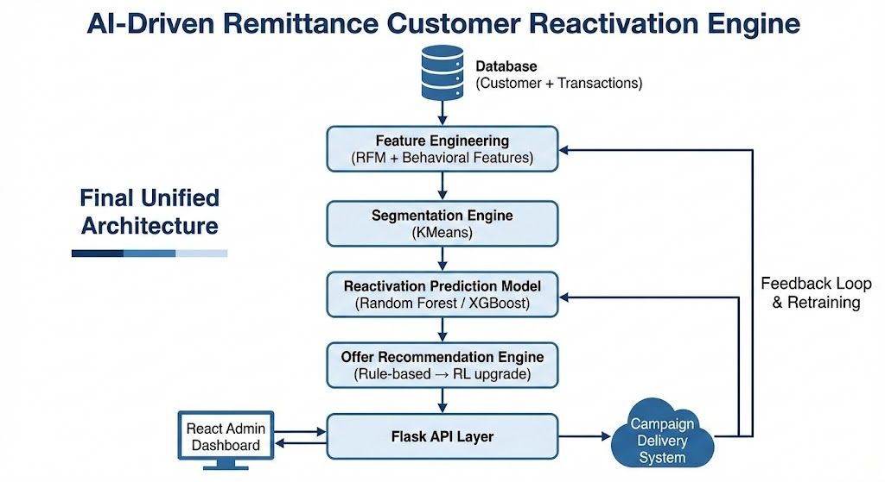

Here is your cleaned, structured **project report with proper GitHub links embedded** and positioned professionally.

---

# AI-Driven Remittance Customer Reactivation Engine

Full-Stack Production Blueprint

---

## 1️⃣ Project Overview

This is not a notebook demo.
It is a **full-stack, deployable AI system** that:

* Identifies inactive remittance customers
* Predicts reactivation probability
* Segments behavioral clusters
* Recommends personalized offers
* Optimizes targeting strategy
* Tracks revenue recovery

The system architecture combines production-ready open-source repositories and adapts them into a unified enterprise-grade solution.

---

# 2️⃣ Core Repository Foundations

## 1. Full-Stack Backend Foundation

### ChurnShield-App

GitHub:
[https://github.com/bijay-odyssey/ChurnShield-App](https://github.com/bijay-odyssey/ChurnShield-App)

### What It Provides

* Flask-based web application
* Random Forest churn prediction pipeline
* SQLAlchemy integration
* Admin dashboard
* Deployment support (Gunicorn/Railway)

### Why It Fits

You already work with Flask/Django.
This gives you:

* API structure
* Model integration pattern
* Admin analytics view

### Adaptation for Remittance

Convert:

Stay / Exit → Active / Inactive

Retention strategy → Remittance-specific incentive engine

Example:

* Free first transfer to India
* 0% fee on UAE corridor
* Cashback on high-value senders

---

## 2. Customer Segmentation Engine

### Predict-Customer-Personality-to-Boost-Marketing-Campaign-using-Machine-Learning

GitHub:
[https://github.com/riyouuyt/Predict-Customer-Personality-to-Boost-Marketing-Campaign-using-Machine-Learning](https://github.com/riyouuyt/Predict-Customer-Personality-to-Boost-Marketing-Campaign-using-Machine-Learning)

### What It Provides

* KMeans clustering
* RFM-based feature engineering
* Behavioral segmentation
* Visualization dashboards

### Why It Fits

Remittance marketing fails when messaging is generic.

Segmentation enables:

* High-value inactive users
* Corridor-loyal senders
* Price-sensitive users
* Seasonal remitters

You use clusters to tailor offers.

---

## 3. Advanced Offer Optimization (RL Layer)

### retailsynth-agentsim

GitHub:
[https://github.com/RetailMarketingAI/retailsynth-agentsim](https://github.com/RetailMarketingAI/retailsynth-agentsim)

### What It Provides

* Reinforcement Learning simulation
* Coupon targeting optimization
* Policy benchmarking
* Sparse-event handling

### Why It Fits

Remittance activity is event-driven.
Customers transact irregularly.

RL helps decide:

* Which offer
* Which channel
* What timing

Reward = Successful reactivation transaction

---

## 4. Lead Reactivation Logic

### leads-reactivation-with-AI-Voice-Agent

GitHub:
[https://github.com/kaymen99/leads-reactivation-with-AI-Voice-Agent](https://github.com/kaymen99/leads-reactivation-with-AI-Voice-Agent)

### What It Provides

* Automated outreach logic
* Cold-lead reactivation strategy
* Intent qualification

### Why It Fits

Inactive remittance users behave like cold leads.

Logic can be reused for:

* Email campaigns
* WhatsApp reactivation
* SMS targeting

---

# 3️⃣ Final Unified Architecture

## Layered System Design

Database (Customer + Transactions)
↓
Feature Engineering (RFM + Behavioral Features)
↓
Segmentation Engine (KMeans)
↓
Reactivation Prediction Model (Random Forest / XGBoost)
↓
Offer Recommendation Engine (Rule-based → RL upgrade)
↓
Flask API Layer
↓
React Admin Dashboard
↓
Campaign Delivery System
↓
Feedback Loop & Retraining

---

# 4️⃣ MVC Architecture

## Model Layer

* Customer model
* Transaction model
* ML model artifacts (.pkl)
* Segmentation cluster labels
* Offer engine logic
* Campaign response tracking

---

## View Layer

React dashboard displaying:

* Inactive customer list
* Reactivation probability scores
* Segment distribution
* Campaign ROI metrics
* Revenue recovered

---

## Controller Layer

Flask REST API:

* `/predict-reactivation`
* `/recommend-offer`
* `/trigger-campaign`
* `/campaign-performance`

---

# 5️⃣ Tech Stack

Backend:

* Python
* Flask
* SQLAlchemy
* Gunicorn

ML:

* scikit-learn
* XGBoost (upgrade path)
* Reinforcement Learning (Stable Baselines optional)

Frontend:

* React
* Chart.js / Recharts

Database:

* PostgreSQL or MySQL

Deployment:

* Docker
* Nginx
* AWS EC2 / Railway / Render

---

# 6️⃣ Development Plan

### Phase 1 – Backend Setup

Use structure from:
ChurnShield-App

Adapt models for remittance schema.

---

### Phase 2 – Segmentation

Implement RFM + KMeans logic from:
Predict-Customer-Personality

Assign cluster labels.

---

### Phase 3 – Reactivation Model

Train:

Random Forest
or XGBoost

Evaluate:

* ROC-AUC
* Precision@Top10%
* Recall

---

### Phase 4 – Offer Engine

Start rule-based:

If High-value inactive → Cashback
If Price-sensitive → Fee waiver
If Corridor-loyal → Corridor promo

Later integrate RL from:
RetailSynth-AgentSim

---

### Phase 5 – Dashboard

React admin panel showing:

* Revenue recovered
* Segment-level uplift
* Campaign performance

---

# 7️⃣ Advantages of This Blueprint

* Full-stack ready
* Portfolio strong
* Demonstrates ML + backend engineering
* Shows business understanding
* Extensible to uplift modeling

---

# 8️⃣ Risks & Considerations

* Data quality dependency
* Cold-start problem
* RL requires high traffic
* Financial compliance requirements
* Model drift over time

---

# 9️⃣ Why This Portfolio Stands Out

This shows:

* System design thinking
* Production awareness
* Business KPI alignment
* Advanced AI capability (segmentation + RL)

It is stronger than a simple churn notebook.

---

