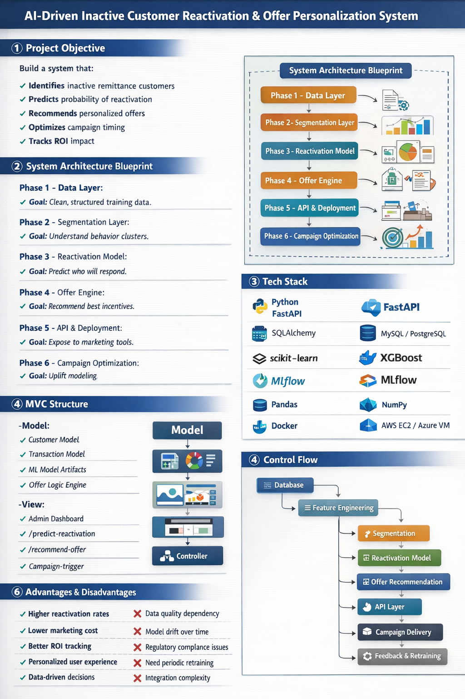

---

# COMPLETE EXECUTION BLUEPRINT (REVISED & EXPANDED)

---
# 📌 PROJECT INTRODUCTION

In remittance services, many registered customers make only one or occasional transfers and then stop. Broad, generic reactivation campaigns waste budget and deliver poor results. This project builds an **AI-driven reactivation engine** that:

* Identifies inactive customers with high reactivation potential
* Predicts the probability of reactivation
* Recommends personalized offers (fee waivers, cashback, corridor promos)
* Optimizes campaign timing and budget
* Tracks campaign impact and ROI over time

This system combines structured ML models, behavior segmentation, offer logic, and a production API to drive smarter marketing automation.

# 1️⃣ PROJECT OBJECTIVE

Build an AI system that:

* Detects inactive remittance users
* Predicts reactivation probability
* Recommends personalized offers
* Optimizes campaign targeting
* Tracks ROI, uplift, and marketing efficiency

---

# 2️⃣ BUSINESS DEFINITIONS (MISSING BEFORE)

You must define this clearly before writing one line of code.

### Inactivity Definition

* No transaction in last 60 days (configurable)

### Reactivation Definition

* At least one transaction within 30 days after campaign

### Target Variable

Binary label:

* 1 → Reactivated
* 0 → Not reactivated

### KPI Targets

* Increase reactivation rate by +15%
* Reduce campaign cost per conversion by -20%
* Improve repeat transaction rate

---

# 3️⃣ DATA REQUIREMENTS (CRITICAL ADDITION)

## Required Tables

### Customers

* customer_id
* registration_date
* country
* preferred_corridor
* branch_id
* KYC_status

### Transactions

* transaction_id
* customer_id
* amount
* corridor
* fee_paid
* transaction_date
* exchange_rate
* channel (app/branch)

### Campaign

* campaign_id
* offer_type
* campaign_date
* customer_id
* response_flag

---

# 4️⃣ SYSTEM ARCHITECTURE (DETAILED)

## Layer 1 — Data Pipeline

Tooling:

* Pandas
* SQLAlchemy
* Airflow (optional automation)

GitHub Reference:

* [https://github.com/entbappy/End-to-End-ML-Project](https://github.com/entbappy/End-to-End-ML-Project)
* [https://github.com/apache/airflow](https://github.com/apache/airflow)
  Maintained by Apache Software Foundation

Deliverables:

* Clean dataset
* Feature store
* Training-ready table

---

## Layer 2 — Feature Engineering

### RFM Features

* Recency
* Frequency
* Monetary value

### Behavioral Features

* Avg transaction amount
* Corridor diversity
* Fee sensitivity ratio
* Seasonal pattern

### Campaign Features

* Last offer type
* Time since last campaign
* Past response rate

---

## Layer 3 — Segmentation

Model:

* KMeans

GitHub:

* [https://github.com/scikit-learn/scikit-learn](https://github.com/scikit-learn/scikit-learn)
  Maintained by scikit-learn

Output:

* VIP inactive
* Price sensitive
* Corridor loyal
* High churn risk

---

## Layer 4 — Reactivation Prediction

Primary Model:

* XGBoost

GitHub:

* [https://github.com/dmlc/xgboost](https://github.com/dmlc/xgboost)
  Maintained by XGBoost

Metrics to Track:

* ROC-AUC
* Precision
* Recall
* F1-score
* Lift curve

Expected Accuracy:
75–85% on structured financial data

---

## Layer 5 — Offer Recommendation

Option 1: Rule Engine (MVP)
Option 2: Ranking Model

GitHub:

* [https://github.com/recommenders-team/recommenders](https://github.com/recommenders-team/recommenders)
  Maintained by Microsoft

Output:
Top 3 ranked offers per customer.

---

## Layer 6 — Uplift Modeling (Budget Optimization)

GitHub:

* [https://github.com/uber/causalml](https://github.com/uber/causalml)
  Maintained by Uber

Purpose:
Target only customers who react because of campaign.

---

## Layer 7 — API Layer

Framework:

* [https://github.com/tiangolo/fastapi](https://github.com/tiangolo/fastapi)
  Created by Sebastián Ramírez

Endpoints:

* /score-customer
* /recommend-offer
* /campaign-trigger
* /metrics

---

## Layer 8 — Model Management

Tool:

* [https://github.com/mlflow/mlflow](https://github.com/mlflow/mlflow)
  Maintained by MLflow

Track:

* Experiments
* Model versions
* Production deployment

---

# 5️⃣ MVC STRUCTURE (PRODUCTION READY)

## Model Layer

* ORM models
* ML artifacts
* Feature transformer
* Offer engine

## View Layer

* React Admin Dashboard
* Campaign metrics view
* Risk score panel

## Controller Layer

* REST APIs (FastAPI)
* Campaign scheduling logic
* Authentication middleware

---

# 6️⃣ TECH STACK (FINALIZED)

Backend:

* Python
* FastAPI
* SQLAlchemy

Database:

* PostgreSQL / MySQL

ML:

* scikit-learn
* XGBoost
* LightGBM
* MLflow

Optional:

* PyTorch (for LSTM)
  Maintained by PyTorch

DevOps:

* Docker
* Nginx
* AWS EC2 / Azure

Frontend:

* React
* Chart.js

---

# 7️⃣ DEVELOPMENT TIMELINE (REALISTIC)

Week 1–2
Data cleaning + feature engineering

Week 3–4
Churn model training + tuning

Week 5
Offer recommendation logic

Week 6
API development + DB integration

Week 7
Dashboard + pilot campaign

Week 8
Uplift modeling + optimization

---

# 8️⃣ ML vs DEEP LEARNING (ACCURATE COMPARISON)

| Factor              | Machine Learning | Deep Learning |
| ------------------- | ---------------- | ------------- |
| Data Size           | Medium           | Very Large    |
| Accuracy            | 75–85%           | 80–88%        |
| Interpretability    | High             | Low           |
| Infrastructure Cost | Low              | High          |
| Training Time       | Fast             | Slow          |
| Regulatory Risk     | Low              | Higher        |

Blunt truth:

For structured tabular remittance data,
XGBoost usually beats neural networks.

Only use LSTM if:

* You have large transaction sequences
* 1M+ records
* Time-series modeling required

---

# 9️⃣ ADDITIONAL MISSING COMPONENTS (IMPORTANT)

You were missing these:

### Data Drift Monitoring

* Monitor feature distribution changes

### Retraining Strategy

* Retrain every 30–60 days

### A/B Testing Framework

* Control group vs AI group

### ROI Formula

ROI = (Revenue from Reactivated − Campaign Cost) / Campaign Cost

---

# 10️⃣ FINAL PRODUCTION FLOW

Raw DB
↓
Feature Engineering
↓
Segmentation
↓
Reactivation Model
↓
Offer Ranking
↓
Uplift Filtering
↓
API
↓
Campaign
↓
Performance Logging
↓
Retraining

---

